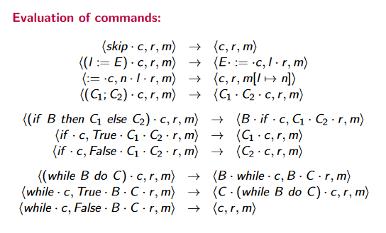

# SIMP-abstract-machine

In 2020/21 I was a Teaching Assistant for the second year module 5CCS2PLD Programming Language Paradigms at King's
College London. PLD deals with formal semantics and verification of programming languages.

For exploring semantics, the module
textbook ([Programming Languages and Operational Semantics](https://link.springer.com/book/10.1007/978-1-4471-6368-8#about))
defines an educational language SIMP (the Simple Imperative Language), for which an abstract syntax and abstract machine
semantics are given.

This project is a Java implementation of the SIMP abstract machine used to teach students about formal reasoning of SIMP programs.

## Abstract syntax

The following is a concise overview of the abstract syntax of SIMP. This syntax is represented as classes and enums in
the command, integer, and bool packages.  

## Abstract machine

An abstract machine interprets an abstract syntax tree of a SIMP program and follows a transition system to evaluate the
programs.

### Configuration

The abstract machine is defined as a tuple (c, r, m), called a configuration, where

* c is a control stack used to store the program and determines which transitions to follow
* r is an auxiliary stack (also called results stack) that stores intermediary results
* m is memory, also called a store, modelled by a partial function mapping each string addresses to memory. Memory is
  used to store variables and acts as I/O to the program.

The control stack (c) and result stack (r) can each hold fixed data types:
  
These types are represented in Java using the ControlStackable and ResultsStackable interfaces. Note that (a • b)
indicates a stack where a is on top of b.

### Transitions

To simulate a SIMP program, a set of transition rules are defined. These determine how the abstract machine changes
configurations based on what is at the top of the control stack.
  
  
These transitions are implemented in the Evaluator class.

## Usage

To run a SIMP program, it must be represented as an abstract syntax tree and passed to the Evaluator class as a
constructor argument.

An example program that calculates x^n can be found in the Main class.

## Further information

Additional information about SIMP can be found in Maribel Fernandez's
textbook [Programming Languages and Operational Semantics](https://link.springer.com/book/10.1007/978-1-4471-6368-8#about)
